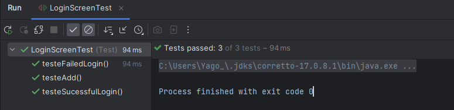

# Documentando tela de Login

## Tarefa 

Criar um cenário de teste documentado realizado em Junit, seguindo padrão TDD(Test Driven Development), com a geração de um Javadoc.

## Criando a classe de teste Login

    Seguindo o padrão TDD, primeiro realizamos a criação dos testes antes de criarmos as classes do projeto,
    de forma a visar quais são os recursos necessarios para o funcionamento do programa.

        public class LoginScreenTest {
        @Test
        public void testeSucessfulLogin(){
        LoginScreen loginScreen = new LoginScreen();
        Assertions.assertTrue(loginScreen.login("john", "password123"));
        }
    
        @Test
        public void testeFailedLogin(){
         LoginScreen loginScreen = new LoginScreen();
         Assertions.assertFalse(loginScreen.login("john", "wrong"));
        }
    
        @Test
        public void testeAdd(){
            LoginScreen loginScreen = new LoginScreen();
            loginScreen.addUser("Yago", "123");
            Assertions.assertTrue(loginScreen.login("Yago", "123"));
        }
    
    }
    

    Em seguida vemos os erros do codigo quais aponta para possamos verificar os recursos necessarios para realização dos testes.

## Criando a Classe LoginScreen

    Com os erros resultantes da falta da classe utilizada nos teste, 
    criamos a classe necessaria, 
    juntamente dos metodos requisitados para que os testes possam ser realizados.

        
    package Test;
    
    import java.util.HashMap;
    import java.util.Map;
    
    
    private Map<String, String> userDatabase;
    
    
    public LoginScreen(){
    userDatabase = new HashMap<>();
    userDatabase.put("john", "password123");
    userDatabase.put("alice", "securepass");
    }
    
    
    public boolean login(String username, String password) {
    if(userDatabase.containsKey(username)){
    String storedPassword = userDatabase.get(username);
    if(storedPassword.equals(password)){
    return true; // Verificação com sucesso
    }
    
    }
    return false; // Verificação falhada
    }
    
    
    public void addUser(String username, String password){
    userDatabase.put(username, password);
    }
    }

## Rodando os testes

    Agora podemos rodar os testes para verificar
    se as regras de negócio estão a ser aplicadas de 
    forma correta.

## Documentando para gerar um Javadoc

    Após verificar que todas as regras de négocio 
    estão funcionando conforme o previsto, documentanmos 
    o código para poder gerar um arquivo Javadoc, com explicações
    das funcionalidades e funcionamento do projeto.

    package Test;
    
    import java.util.HashMap;
    import java.util.Map;

    /**
    * Uma classe para simular a conexao com banco de dados e validacao de login
    */
    public class LoginScreen {
        /**
        * Simula um banco de dados (username, password)
        */
        private Map<String, String> userDatabase;
    
        /**
         *  Cria uma instacia de LoginScreen
         *  insere registros na sua criacao para simular um banco de dados
         */
        public LoginScreen(){
            userDatabase = new HashMap<>();
            userDatabase.put("john", "password123");
            userDatabase.put("alice", "securepass");
        }
    
        /**
         * Tentativa de verificar a atenticidade das credenciais passadas
         *
         * @param username o usuario da pessoa que esta tentando realizar login
         * @param password a senha da pesso que esta tentando realizar login
         * @return {@code true} se a verificacao for um sucesso, caso contrario {@code false}
         */
        public boolean login(String username, String password) {
            if(userDatabase.containsKey(username)){
                String storedPassword = userDatabase.get(username);
                if(storedPassword.equals(password)){
                    return true; // Verificação com sucesso
                }
    
            }
            return false; // Verificação falhada
        }
    
        /**
         * Adiciona um novo usuario ao 'banco de dados'
         * este metodo nao e recomendado para uso em producao
         *
         * @param username o usuario a ser inserido no banco de dados
         * @param password a senha a ser inserida no banco de dados
         */
        public void addUser(String username, String password){
            userDatabase.put(username, password);
        }
    }

    Após o código ser documentado corretamente, pode-se gerar o arquivo Javadoc.

